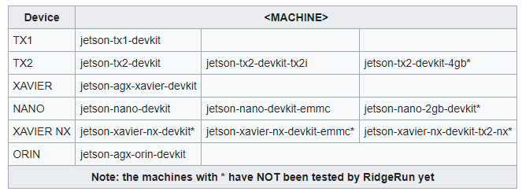

# Lista de comandos necesarios durante el taller

Este es el contenido introductorio del documento. Aquí puedes agregar una descripción general o un resumen.

## SSH

En powershell se debera de ejecutar el comando de 

ssh username@ip

reemplazando el username por el generado en el paso 10 y la direccion ip que se detalla en el paso 13

## Creacion del escritorio remoto por medio de xrdp

Se contiene la lista de comandos para instalar y configurar xrdp.

1. sudo apt update
2. sudo apt install xfce4 xfce4-goodies -y
3. sudo apt install xrdp -y
4. sudo systemctl status xrdp
Si el estado no es running ejecutar este comando
	4.1. sudo systemctl start xrdp
5. echo "xfce4-session" | tee .xsession
6. sudo systemctl restart xrdp
7. sudo ufw allow from ip/32 to any port 3389
8. sudo ufw status

## Instalacion de Yocto en la VM por medio de xrdp. 

Usar el siguiente comando para poder instalar las dependencias de yocto en ubuntu
1. sudo apt install gawk wget git diffstat unzip texinfo gcc build-essential chrpath socat cpio python3 python3-pip python3-pexpect xz-utils debianutils iputils-ping python3-git python3-jinja2 python3-subunit zstd liblz4-tool file locales libacl1
2. sudo locale-gen en_US.UTF-8
3. git clone git://git.yoctoproject.org/poky
4. git checkout -t origin/kirkstone -b my-kirkstone
5. cd poky
6. mkdir build
7. source oe-init-build-env build
8. bitbake core-image-minimal
Wait .... 

## Configuracion de algunas caracteristicas y archivos de Yocto

1. Abrir el archivo ubicado en build/conf/local.conf y observar los siguientes parametros

MACHINE ?= "<MACHINE>"

DISTRO_FEATURES = "x11 opengl "

IMAGE_CLASSES += "image_types_tegra"
IMAGE_FSTYPES = "tegraflash"

SSTATE_DIR ?= "/home/${USER}/Yocto/sstate_dir"
DL_DIR ?= "/home/${USER}/Yocto/downloads"

el apartado de machine se debe de reemplazar por 

