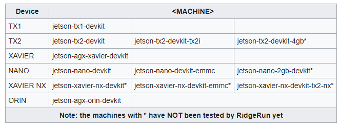

# Lista de comandos necesarios durante el taller

Este es el contenido introductorio del documento. Aquí puedes agregar una descripción general o un resumen.

## SSH

En powershell se debera de ejecutar el comando de 

ssh username@ip

reemplazando el username por el generado en el paso 10 y la direccion ip que se detalla en el paso 13

## Creacion del escritorio remoto por medio de xrdp

Se contiene la lista de comandos para instalar y configurar xrdp.

1. sudo apt update
2. sudo apt install xfce4 xfce4-goodies -y
3. sudo apt install xrdp -y
4. sudo systemctl status xrdp
Si el estado no es running ejecutar este comando
	4.1. sudo systemctl start xrdp
5. echo "xfce4-session" | tee .xsession
6. sudo systemctl restart xrdp
7. sudo ufw allow from ip/32 to any port 3389
8. sudo ufw status

## Instalacion de Yocto en la VM por medio de xrdp. 

Usar el siguiente comando para poder instalar las dependencias de yocto en ubuntu
1. sudo apt-get install gawk wget git-core diffstat unzip texinfo gcc-multilib build-essential chrpath socat libsdl1.2-dev xterm
2. YOCTO_DIR=/home/$USER/yocto-tegra
3. mkdir $YOCTO_DIR
3. export BRANCH="dunfell"
4. cd $YOCTO_DIR
5. git clone -b ${BRANCH} git://git.yoctoproject.org/poky.git poky-${BRANCH}
6. git clone -b ${BRANCH}-l4t-r32.4.3 https://github.com/madisongh/meta-tegra.git
7. cd $YOCTO_DIR
8. source poky-${BRANCH}/oe-init-build-env build
Wait .... 

## Configuracion de algunas caracteristicas y archivos de Yocto

1. Abrir el archivo ubicado en build/conf/local.conf y observar los siguientes parametros

MACHINE ?= "<MACHINE>"

IMAGE_CLASSES += "image_types_tegra"
IMAGE_FSTYPES = "tegraflash"

SSTATE_DIR ?= "/home/${USER}/Yocto/sstate_dir"
DL_DIR ?= "/home/${USER}/Yocto/downloads"

PREFERRED_VERSION_python3 = "3.6%"
PREFERRED_VERSION_python3-native = "3.6%"

el apartado de "<MACHINE>" se debe de reemplazar por alguna target board de la siguiente tabla:

Para el archivo llamado bblayers.conf se deberan de agrear los siguientes pats:

 BBLAYERS ?= " \         
  /home/${USER}/yocto-tegra/meta-tegra \                                                                                                                                                                                                                                                                                                                                        
  /home/${USER}/yocto-tegra/poky-dunfell/meta \       
  /home/${USER}/yocto-tegra/poky-dunfell/meta-poky \                                                                                                                                                                
  /home/${USER}/yocto-tegra/poky-dunfell/meta-yocto-bsp \                                                                                                                                                                                                                                                                                                    
  "

  bitbake core-image-sato-dev
